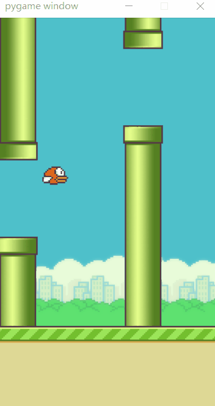

# 基于DQN的FlappyBird

> 强化学习打卡营 终级项目复现
环境地址为：[https://github.com/ntasfi/PyGame-Learning-Environment](https://github.com/ntasfi/PyGame-Learning-Environment)

课程地址：[https://aistudio.baidu.com/aistudio/education/group/info/1335](https://aistudio.baidu.com/aistudio/education/group/info/1335)

## 简介
基于PARL 与百度Paddle框架的强化学习项目, 目标是让小鸟飞过尽可能的水管(?)。本项目使用DQN训练模型去训练。代码框架主要基于上述课程地址的第4节课程的例程并进行调整。

## 环境
游戏基于 pygame 与 PLE 
训练基于paddle与PARL 框架
```
!python -m pip install paddlepaddle -i https://mirror.baidu.com/pypi/simple
!pip install parl
!pip install pygame
!python ./PyGame-Learning-Environment/setup.py install
```

## 文件目录
文件名称|介绍
---|---
[Project](./Project)|工程文件夹
[Project/train.py](./Project/train.py)| 用于训练的文件
[Project/test.py](./Project/test.py) |效果展示文件
[Project/Model.py](./Project/Model.py)| DQN内全连接网络的定义
[Project/Agent.py](./Project/Agent.py) | 训练机的定义
[Project/ReplayMemory.py](./Project/RelpayMemory.py)| 经验池的定义
[Modle](./Model)|用于储存模型
[gif](./gif)|展示用图片

## 运行
训练：
```
python ./Project/train.py
```
测试：
```
python ./Project/test.py
```

## 效果展示




> ~~模型还没训练的很好 一般能飞过30个左右 代码仅供参考 ==~~ 

> 8300 轮后 你已经是个成熟的鸟了 